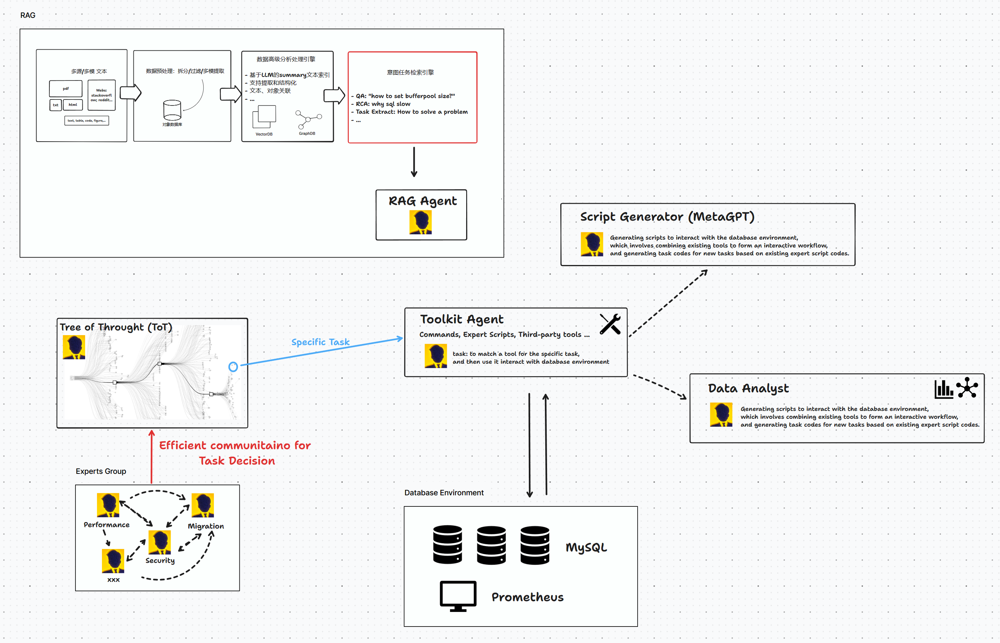
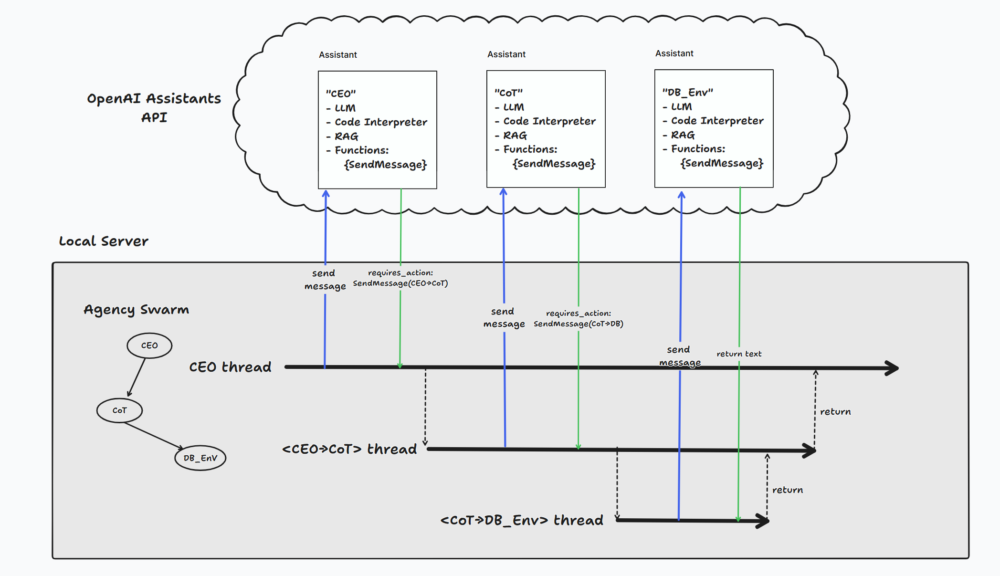
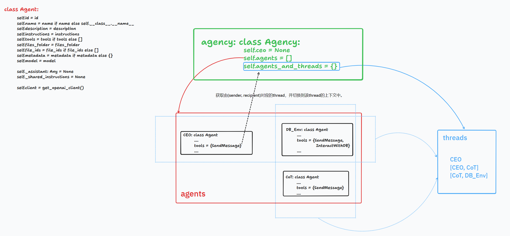

测试日志同步在👉[Test Log (notion.site)](https://lab505.notion.site/3672c63f4796463aa26d92ab4e40aaaa?v=5ae13bcb07804db38c8987d78327c1d7)，整理成表格，其中包括用户任务、Agency会话日志、项目base version、case issues等。


# 待完成功能

## 🔥High Priority
- [] 设计Development Team，并将db_env_proxy加入进去。Development Team应将所有的开发人员加入进去，并设计权限机制。
- [] 重新设计task_intention - user - expert_team_lead的拓扑。甚至我觉得task_intention应该是在用户第一个请求后就被拔掉。因为在后面与用户的确认中，task_intention并未起到任何正面作用。
zz  
## 🧊Low Priority
- [ ] 持续更新Agent知识。最直接的方法是更新RAG。**Continuous Learning**:
    - After each interaction, review the accuracy of your topic categorization.
    - Continuously refine your keyword and phrase recognition patterns based on user feedback and evolving database management trends.

- [ ] 在与DB环境交互的部分，后续使用真实功能替换（低优先级），包括Toolkits Agent，Data Analyzer等
- [ ] 当前Agency-Swarm框架中Agent间沟通的**目的**是“问答”（且单向），这种单一目的的交流方式限制了Agency任务能力。后续考虑在Agency-Swarm底层追加其他目的形式的沟通方式，例如某个Agent有自己的主线任务，它通过其它Agent那里获取消息来不断思考自己的任务。
- [ ] OpenAI Assistant具备并行调用Functions能力，见[Parallel function calling](https://platform.openai.com/docs/guides/function-calling/parallel-function-calling)。在设计Agent时候需要在任务规划时候考虑到并行函数的能力。例如，Expert Team Leader可以将可以并行处理的任务同时发给三个不同的Experts，将他们返回的结果做后一步的处理。但如果不需要汇总他们的结果再做处理，则可以考虑创建新的Thread/session来并发发起任务。
- [ ] 自定义更多功能的SendMessage函数。当前SendMessage函数属于通用内同CoT的提示词。但针对不同类型对话，使用自定义的SendMessage可能会更好。当前所有的会话类型都是“任务规划和执行”。
- [ ] Agent Wait preparation机制。例如Team Leader需要等待并汇总（根据某个任务列表）所有Experts的任务意见后，再定夺下一步行动。这样的决策质量可能会更高，降低由于信息不全导致的决策失误。


## ✅Finished
- 初步构建一个Agency for DBA
- 关于SendMessage有以下几点不足：（已在底层AgencySwarm框架中改造完成）
  1. ~~缺少对父任务的描述。目前SendMessage去invoke接收者thread时，仅会发送对新任务的描述，缺少总任务的背景和当前的状态。~~
   ~~\- 考虑：在SendMessage中添加父任务描述的参数。~~
  2. ~~无关联任务会复用Thread。这会导致无关联的任务的上下文混合在Thead中。~~
   ~~\- 考虑：为新主题的任务创建新的Session。这涉及到如何决策是否要创建新的Session，新的Session中的Assistant.Thread如何创建。例如，可以同时为<Sender, Recipient>创建新的Assistant.Thread，并且在框架中起一个新的Python进程来驱动该Session。~~

# 研究难题

## 🔥High Priority

- [ ] 提示词工程：如何为Agent角色化提供初始Instruction，促使任务高质量推进。Instruction需要考虑以下方面 （参考：LMOps）

  - 动作细节

  - 接收者非人类，而是Agent

  - 输出的一致性

  - 输出的丰富性
- [ ] 任务规划：ToT技术。如何在以自然语言作为任务的场景中使用ToT技术。需要考虑两方面：
  - 开放的任务描述 → 有限完备的Actions集合
  - 为Action打分，eg, UCT
- [ ] 任务回溯技术。在一个Thread中的任务执行中遇到任务失败时候，需要回溯到上一个分叉节点重新规划路径。那么就需要重新整理这段失败路径上所有参与讨论的Agent的Memory。如何选择上一个分叉节点，如何整理失败经验重新执行任务需要解决。（世杰）
- [ ] **思考如何构造测试benchmark来测试每次升级后MA结构的表现。包括测试用例、数据模型等**


# 待解决底层机制和框架工程问题

## 🔥High Priority

- [ ] 添加自定义函数并发执行
- [ ] 添加Waiting机制，`SendMeassage_Waiting_for(for_what, response_to_whom)`
  - 该机制用于构建无需回溯的任务图DAG，以减少由于回溯导致的消息传递冗余，增加任务推进清晰度。

- [ ] 增加架构的灵活性（flexibility），比如可插拔，可变换拓扑形态

## 🧊Low Priority

- [ ] 【AgencySwarm Issue】目前AgencySwarm的Agent间交流机制是同步版本，从root agent (CEO) 开始，<u>递归的</u>调用相关Agent的SendMessage函数。虽然在AgencySwarm抽象出了CommunicationThread对象（见`agency_swarm\threads\thread.py`），即每个pair <sender agent, recipient agent> 所对应的上下文，但所有的Thread对象在单线程中被串行执行，而且消息回复仅仅是简单的function return。后面需要改成多线程，异步版本。备注：当前版本是通过`Thread._execute_tool(thread.self, self.recipient_agent.SendMessage())`来attach到新的CommunicationThread上下文的。

  - 修改思路：每个Agent的实现为一个系统线程，Agent实例包含着对应Assitant环境，和由self作为message Sender的所有会话（Session）。我们使用Session替换掉CommunicationThread，因为CommunicationThread对象实在单线程中被Agency全局管理，Session由Agent线程自己管理。这样消息发送/回复的机制就可以是REST接口了。
  - AgencySwarm原始方案
     
  - [ ] [AgencySwarm]未考虑step status = 'tool_calls'的情况，在该状态下assistant将并行调用多个自定义functions
  - [ ] 将专家团Expert Team打包成另一个Agency，可能由Team Leader Agent作为对外接口。整个架构是由多个主题的Agencies组成。[重要不紧急]
  - [ ] 无法发起多个Agents共同参与的会话。(目前还未有这种需求场景)
    - 考虑，基于Assistant.Thread添加多人会话机制，重点是消息内容（比如要显示角色名称），消息处理方式，讨论方式。

  - [ ] 考虑运行时自主修改（增删改）Assistant Instruction，可根据任务的执行状态自动优化Assistant和MA结构。(未遇到该需求，可能会产生在触发了某些特殊事件)

    - 参考👉 [Step 4: Run the Assistant](https://platform.openai.com/docs/assistants/overview/step-4-run-the-assistant)

      > You can [optionally pass new instructions](https://platform.openai.com/docs/api-reference/runs/createRun#runs-createrun-instructions) to the Assistant while creating the Run but note that these instructions override the default instructions of the Assistant.
      >
      > ```python
      > run = client.beta.threads.runs.create(
      >  thread_id=thread.id,
      >  assistant_id=assistant.id,
      >  instructions="Please address the user as Jane Doe. The user has a premium account."
      > )
      > ```

  - [ ] 

## ✅Finished

- 实现伪DB交互环境
  - 实现在DBMA/db_pseudo_env目录中。包含着一个伪DB环境Web Server，和向伪DB环境发送任务消息的Client。使用命令`python db_pseudo_env/db_pseudu_env_server.py`启动伪DB环境Server，并访问 http://localhost:5000/task 查看任务并手动输入任务执行结果。
- [Agency-Swarm related] 区分打印消息时候的"talk to"和“response to"的图标。当前版本统一用了🗣️表示。
- 解决由于Function call时间过长导致OpenAI会话过期。
  - 由于调用自定义Funtion超时后，Funtion执行结果提交失败，导致RUN进入expired状态。但由于目前AssistantAPI不支持编辑RUN’step，这就无法做到断点续传。因此我们妥协的解决方法是把函数的执行结果包装成提示词消息追加到Thread中，然后re-RUN。
- [Agency-Swarm related] 打印所有运行时日志。日志目录存放在`os.environ['AS_PROJECT_ROOT']`指定的环境变量中（在本项目中`main.py`中定义）


# 

# 🛠️相关技术

## AlphaZero

[Mastering the game of Go with deep neural networks and tree search | Nature](https://www.nature.com/articles/nature16961)

[Mastering the game of Go without human knowledge | Nature](https://www.nature.com/articles/nature24270)

[AlphaZero: Shedding new light on chess, shogi, and Go - Google DeepMind](https://deepmind.google/discover/blog/alphazero-shedding-new-light-on-chess-shogi-and-go/)


## LMOps

[microsoft/LMOps: General technology for enabling AI capabilities w/ LLMs and MLLMs (github.com)](https://github.com/microsoft/LMOps)

https://www.promptingguide.ai/

## Instructor

[jxnl/instructor: structured outputs for llms (github.com)](https://github.com/jxnl/instructor)


## ToT/CoT

| Paper                                                        | Topic                                                        | Summary                                                      |
| ------------------------------------------------------------ | ------------------------------------------------------------ | ------------------------------------------------------------ |
| Self-Consistency Improves Chain of Thought Reasoning in Language Models | expand CoT                                                   | CoT的一个完善，简单来说，就是对于一个任务采用多个CoT，最后让所有的CoT进行投票，票数最多结果作为输出 |
| Tree of Thoughts: Deliberate Problem Solving with Large Language Models | ToT,Long Reasoning                                           | 介绍了CoT的不足之处，以sum24，创意写作为实例介绍了ToT的基本思想以及内容 |
| Large Language Model Guided Tree-of-Thought                  | ToT System,Long Reasoning                                    | 以数独游戏为示例，设计了一个具体的ToT system来指导LLM完成较难的任务 |
| Reasoning with Language Model is Planning with World Model   | Reasoning via planning,LLM for Planning,Monte Carlo Tree Search | 文中提出了一个world-model，将任务的解决规划成state0->action0->state1->action1->......根据采取行动后的state来评估action的价值，从而更好地选取action，同时引入奖励机制利用MCTS的方法来进行action空间搜索，从而进行任务规划，该方法在任务规划，长数学推理，长逻辑推理方面都有较好的表现，（DB-GPT中的根因分析就是基于该部分做的） |
| Automatic Chain of Thought Prompting in Large Language Models | Auto CoT                                                     |                                                              |


相关工作

[[2308.10848\] AgentVerse: Facilitating Multi-Agent Collaboration and Exploring Emergent Behaviors (arxiv.org)](https://arxiv.org/abs/2308.10848)